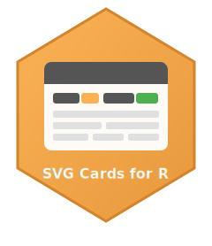

<!-- README.md is generated from README.Rmd. Please edit that file -->

```{r, include = FALSE}
knitr::opts_chunk$set(
  collapse = TRUE,
  comment = "#>",
  fig.path = "man/figures/README-",
  out.width = "100%",
  eval = FALSE
)
```

# cardargus 

<!-- badges: start -->
[](https://CRAN.R-project.org/package=cardargus)
[](https://cran.r-project.org/web/checks/check_results_cardargus.html)
[](https://strategicprojects.github.io/cardargus/)
[](https://cran.r-project.org/package=cardargus)
[](https://cran.r-project.org/package=cardargus)
[](https://opensource.org/licenses/MIT)
[](https://github.com/StrategicProjects/cardargus)
[](https://lifecycle.r-lib.org/articles/stages.html#experimental)
[](https://github.com/StrategicProjects/cardargus/commits/main)
[](https://github.com/StrategicProjects/cardargus/issues)
[](https://github.com/StrategicProjects/cardargus/stargazers)
<!-- badges: end -->

**cardargus** is an R package for creating informative SVG cards with embedded styles, Google Fonts, badges, and logos. Cards are self-contained SVG files, ideal for dashboards, reports, and visualizations.

## Installation

Install from CRAN:

```{r}
install.packages("cardargus")
```

Or install the development version from GitHub:

```r
# install.packages("devtools")
devtools::install_github("StrategicProjects/cardargus")
```

## Basic Example

```{r example, eval=TRUE}
library(cardargus)

# Create an informative card
card <- svg_card(
  font = "Jost",
  title = "FAR",
  
  badges_data = list(
    list(label = "Units",         value = "500",     color = "white"),
    list(label = "Federal Grant", value = "$100M",   color = "white"),
    list(label = "State Match",   value = "$80M",    color = "white")
  ),
  
  fields = list(
    list(
      list(label = "Project Name", value = "Boa Vista Residential",
           with_icon = icon_house())
    ),
    list(
      list(label = "Address", value = "123 Flower Street - Downtown")
    ),
    list(
      list(label = "City",   value = "Olinda"),
      list(label = "Region", value = "Pernambuco")
    ),
    list(
      list(label = "Developer",   value = "State Government"),
      list(label = "Contractor",  value = "ABC Construction"), 
      list(label = "Type", value = "PS")  # optional
    )
  ),
  
  bg_color    = "#FF9900",
  title_color = "#fff",
  label_color = "#fff",
  width = 450,
  
  # You can use bundled SVGs or any local file path
  logos = c(
    get_svg_path("seduh.svg"), 
    get_svg_path("morar_bem.svg")
  ),
  logos_height = 40,
  
  bottom_logos = c(
    get_svg_path("tree.svg"), 
    get_svg_path("gov_pe.svg")
  ),
  bottom_logos_height = 40,
  
  footer = paste0(
    "Source: SEDUH/PE on ", 
    format(Sys.time(), "%Y/%m/%d at %H:%M"))
)
```

```{r, eval=TRUE, echo=TRUE}
include_card_png(card, dpi = 300, width = '50%')
```


```{r}
# Save as SVG
save_svg(card, "my_card.svg")

# Convert to high-quality PNG
svg_to_png(card, "my_card.png", dpi = 300)

# Convert to a vector PDF (via rsvg)
svg_to_pdf(card, "my_card.pdf")
```


## Displaying Cards in R Markdown / Quarto

cardargus provides functions to display cards directly in your documents:

```{r display}
# Display card as inline SVG (best quality)
include_card(card)

# Display card as PNG (better compatibility)
include_card_png(card, dpi = 150)

# Save and get path for knitr::include_graphics()
path <- save_card_for_knitr(card, "my_card", format = "png")
knitr::include_graphics(path)
```

For chunk-based workflows, register the cardargus knitr engine:

```{r engine}
# In your setup chunk
register_cardargus_knitr()
```
Then use `cardargus` as a chunk engine:

````markdown
```{cardargus}`
svg_card(title = "My Card", ...)
```
````

## Features

- 📦 **Self-contained SVG**: All styles and fonts embedded
- 🎨 **Customizable**: Colors, fonts, icons, and layouts
- 🌈 **Gradient Backgrounds**: CSS-style linear gradients support
- 🏷️ **Badges**: Shields.io-style with dynamic colors and uniform height
- 🖼️ **Icons**: Built-in SVG icon library
- 📄 **Export**: High-quality PNG with transparent background
- 🔤 **Google Fonts**: Native support via showtext/sysfonts
- 📊 **R Markdown/Quarto**: Direct display functions

## Gradient Backgrounds

Use CSS-style linear gradients for dynamic card backgrounds:

```{r gradient-example, eval=FALSE}
# Horizontal gradient
card <- svg_card(
  title = "HOUSING",
  bg_color = "linear-gradient(to right, #1a5a3a, #2e7d32)",
  ...
)

# Diagonal gradient  
card <- svg_card(
  title = "PROGRAM",
  bg_color = "linear-gradient(135deg, #667eea, #764ba2)",
  ...
)

# Vertical gradient
card <- svg_card(
  title = "PROJECT",
  bg_color = "linear-gradient(to bottom, #00c6ff, #0072ff)",
  ...
)
```

Supported directions: `to right`, `to left`, `to top`, `to bottom`, or angles like `45deg`, `135deg`, `180deg`.

## Custom Cards

```{r custom, eval=TRUE}
# Define badges
badges <- list(
  list(label = "Units", value = "500", color = "white"),
  list(label = "Status", value = "Active", color = "#4CAF50")
)

# Define fields with custom icon
fields <- list(
  list(
    list(label = "Project", value = "Housing Development")
  ),
  list(
    list(label = "City", value = "Pesqueira"),
    list(label = "State", value = "Pernambuco")
  )
)

# Create card with logos
card <- svg_card(
  title = "HOUSING",
  badges_data = badges,
  fields = fields,
  bg_color = "#2c3e50",
  title_color = "#ecf0f1",
  width = 200,
  logos = c(get_svg_path("morar_bem.svg")),
  logos_height = 40,
)
```

```{r, eval=TRUE, echo=FALSE}
include_card_png(card, dpi = 300, width = '25%')
```

## Bundled SVGs

```{r svgs}
# List available SVGs
list_bundled_svgs()

# Get full path
get_svg_path("morar_bem.svg")
```

## Available Icons

```{r icons}
# Built-in icons
icon_house()        # House (default)
icon_building()     # Building
icon_construction() # Construction
icon_map_pin()      # Location
icon_money()        # Money

# Or use your own SVG file
# with_icon = "/path/to/custom_icon.svg"
```

## Font Setup

For best font rendering:

```{r fonts}
# Setup Google Fonts (recommended)
setup_fonts()

# Or download fonts for offline use
install_fonts()

# Check font availability
font_available("Jost")
```

## Chrome Rendering (Recommended)

For **perfect font rendering** with Google Fonts, use headless Chrome:

```{r chrome}
# Check if Chrome is available
chrome_available()

# If Chrome is not installed, download it automatically (~150MB)
ensure_chrome(download = TRUE)

# Convert to PNG with Chrome (best quality)
svg_to_png_chrome(card, "my_card.png", dpi = 300)

# Convert to PDF (vector output)
svg_to_pdf_chrome(card, "my_card.pdf")

# In R Markdown / Quarto - force Chrome engine
include_card_png(card, dpi = 300, engine = "chrome")
```

Install `chromote` for Chrome support:

```r
install.packages("chromote")
```

## Authors

- **Andre Leite** - *Maintainer* - [leite@castlab.org](mailto:leite@castlab.org)
- **Marcos Wasilew** - [marcos.wasilew@gmail.com](mailto:marcos.wasilew@gmail.com)
- **Hugo Vasconcelos** - [hugo.vasconcelos@ufpe.br](mailto:hugo.vasconcelos@ufpe.br)
- **Carlos Amorin** - [carlos.agaf@ufpe.br](mailto:carlos.agaf@ufpe.br)
- **Diogo Bezerra** - [diogo.bezerra@ufpe.br](mailto:diogo.bezerra@ufpe.br)

## License

MIT License - see [LICENSE](LICENSE) for details.
